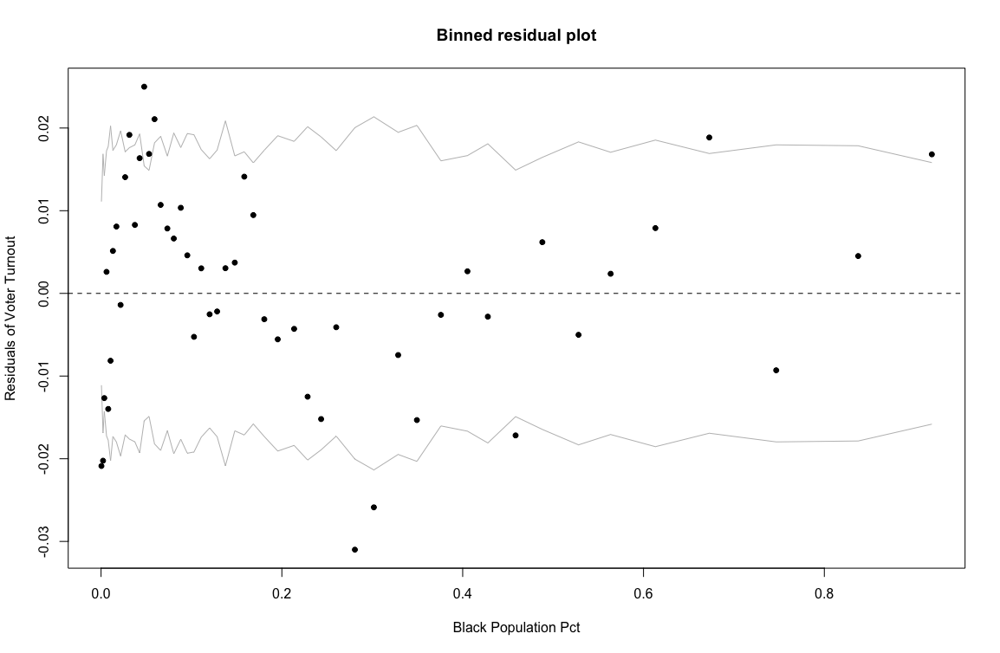

```{r setup, include=F}
knitr::opts_chunk$set(fig.width=3.25, fig.height=3) 

library(tidyverse)
library(tidymodels)

#Load Data
load("hw3.RData")

#Load Functions

uniform_swing <- function(dv,totvotes){
  #get number of districts
  n <- length(dv)
  
  #create data frame that includes democratic votes and total 2-party votes as columns
  df <- data.frame(dv,totvotes)
  
  #create id number for each row
  df$id <- 1:nrow(df)
  
  #create dem vote share
  df$dvoteshare <- dv/totvotes
  
  #count number of wins for dems that occurred in election
  df$dwin <- as.numeric(df$dvoteshare>=0.5)
  
  #get the overall (across districts) vote share for dems in the election
  df$totdvoteshare <- sum(dv,na.rm=T)/sum(totvotes,na.rm=T)
  
  #create grid of possible vote swings from -100 to 100 for each district id
  sims <- expand.grid(swing= 0 - (-100:100)/100,id=df$id)
  
  #merge grid of vote swings by id to election data
  df <- merge(df,sims,by="id")
  
  #keep only those rows where the vote swing (based on aggregate vote share in election) ranges from 0 to 100 pct
  df <- subset(df,(swing>=0 & swing<=totdvoteshare) | (swing<0 & swing > -(1-totdvoteshare))) 

  #Assume vote share in district changes by amount in swing, i.e., .01, then .02, then .03 and so on
  df$dvoteshare_swing <- df$dvoteshare - df$swing
  
  #For each marginal swing in the vote, recalculate winners in district
  df$dwin_swing <- as.numeric(df$dvoteshare_swing >= 0.5)

  #Keep track of overall/aggregate vote swing across districts
  df$dv_swing <- df$totdvoteshare-df$swing

  #For each value of aggregate dem vote share (0 to 100 pct), count the number of Dem seats won
  out_swing <- aggregate(dwin_swing~dv_swing,data=df,FUN=sum)
  
  #Divide by number of districts
  out_swing$dwin_swing <- out_swing$dwin_swing/n
  
  #return data -- each row is a different vote share between 0 and 100
  return(out_swing)
}

bounds <- function(turnout,popshare){
  n <- length(turnout)
  beta_low <- apply(data.frame(rep(0,n),
             (turnout-(1-popshare))/popshare),1,max)
  beta_hi <- apply(data.frame(rep(1,n),turnout/popshare),1,min)
  return(data.frame(beta_low,beta_hi))
}
```

# Assignment Details

This homework assignment is due _March 29_ before midnight. Everyone must complete their own code and assignment, though you may discuss the homework with classmates.

To access the code and data for the assignment, go to RStudio.cloud. To turn in the assignment, upload two files to Canvas: (1) your code file (.Rmd), and (2) a PDF version (click Knit to create PDF).

# Question 1: Ecological Inference

Legal cases on voting rights often require making estimates of the turnout rate of a minority group. In most states, however, it is not possible to know the exact turnout rate of any single population group due to the secret ballot. As a result, analysts often use methods of ecological inference to estimate turnout rates.

The data set `turnout` contains turnout data for North Carolina for the 2012, 2014 and 2016 general elections. Each row is a precinct-year combination. This question explores what we can learn about turnout among racial groups from the aggregate precinct data.

**Q1(a): For one of the election years (2012, 2014 or 2016) in the data, plot the turnout rate (on the y-axis) against the share of black voters in the precinct. Include a regression line -- from the linear regression of turnout share on black voter share -- in the plot. Putting aside other factors, what is the general relationship, if any, between turnout rate and black population share in a precinct? Does this tell you anything about turnout among black voters? What pitfalls are there in drawing a conclusion based on the information in this plot?**

```{r Q1a}
turnout %>% 
  filter(year == 2016) %>% 
  ggplot(aes(`B`, `T`)) +
  geom_point() +
  geom_smooth(method = "lm", se = F) +
  labs(x = "Shares of Black population in NC Precincts (Minimum 75%)",
       y = "Turnoute rate in NC Precincts")
```

Holding all other variables constant, the general linear relationship between turnout rate and Black population share in a precinct is negative and moderately weak. In other words, this relationship states that with a larger proportion of Black residents in a precinct's population, the turnout rate decreases. This relationship implies that Black residents tend to have lower voter turnout than residents of other racial backgrounds, thereby decreasing the overall turnout rate of the precinct. The limitations of drawing a conclusion based on the information in this plot are that (1) there is a substantial concentration of observations in the x = (0.00, 0.25] portion of the plot that fades as x increases, and (2) the scatterplot has a generally moderate amount of noise representing variability that can widen our margin of error when estimating the relationship between these two variables.

**Q1(b): What is the overall turnout rate (as a proportion of registered voters) in the state of North Carolina for each year in the data? What is the overall black population share for each year in the data?**

```{r Q1b}
turnout %>% 
  group_by(year) %>% 
  summarize(overall = weighted.mean(`T`, registered),
            overall_B = weighted.mean(`B`, registered))
```

**Q1(c): For the 2012 election, suppose you want to learn what you can about turnout among black voters in precincts where black registrants comprised more than 75 percent of the registered voters in the precinct. One approach is to use the "method of bounds." Use the function defined above, `bounds()`, to perform this calculation. Create a plot that illustrates how these bounds vary with the share of black voters in a precinct (so, include black population share on the x-axis and black voter turnout on the y-axis). How much variation is there in black turnout rate across precincts? Does the turnout rate appear to depend on the population share?**

```{r Q1c}
q1c <- turnout %>% 
  filter(year == 2012, B > 0.75)

boundsq1c <- bounds(q1c$`T`, q1c$`B`)

q1c %>% 
  ggplot(aes(`B`)) +
  geom_errorbar(ymin = boundsq1c$beta_low, ymax = boundsq1c$beta_hi) +
  scale_y_continuous(limits = 0:1) +
  labs(x = "Shares of Black population in NC Precincts (Minimum 75%)",
       y = "Bounds of Black voter turnout")
```
The variation in black turnout rate across precincts appears to depend on Black population shares in the precinct in an inverse fashion—as the latter increases, the former decreases.

**Q1(d): Estimate ecological regressions with the goal of determining an estimate for the black and non-black turnout rate among registrants in the state. What are your estimates for 2012, 2014 and 2016? In which year is there the smallest gap between estimates in turnout for black and non-black citizens?**

```{r Q1d}
er12 <- lm(`T` ~ -1 + `B` + I(1 - B), 
           data = turnout[turnout$year==2012,]) %>% 
  tidy() %>% 
  select(term, estimate)
er14 <- lm(`T` ~ -1 + `B` + I(1 - B), 
           data = turnout[turnout$year==2014,]) %>% 
  tidy() %>% 
  select(term, estimate)
er16 <- lm(`T` ~ -1 + `B` + I(1 - B), 
           data = turnout[turnout$year==2016,]) %>% 
  tidy() %>% 
  select(term, estimate)

erall <- bind_rows(er12, er14, er16, .id = "year") %>% 
  mutate(year = case_when(year == 1 ~ 2012,
                          year == 2 ~ 2014,
                          year == 3 ~ 2016))

erall
```

2012 has the smallest gap between estimates in turnout for black and non-black citizens.

**Q1(e): The data.frame `turnout_by_race` includes actual, precinct-level turnout and registration data for NC voters in the 2012, 2014 and 2016 elections. That is, it includes information that allows us to know exactly the turnout rate among black and non-black registrants (rather than having to estimate it through ecological regression). Use this data to create a table that displays turnout as a percentage of registered voters in the state for the racial groups in the ecological regression above (i.e., black versus non-black). How much do your estimates from the ecological regression differ from the true turnout rates for black and non-black voters in North Carolina?**


```{r Q1e}
turnout_by_race %>% 
  mutate(race = ifelse(race == "B", "B", "NB")) %>% 
  filter(!is.na(race)) %>% 
  group_by(year, race) %>% 
  summarize(turnout = sum(voted)/sum(registered), .groups = "keep") %>% 
  merge(erall) %>% 
  mutate(diff = turnout - estimate) %>% 
  select(year, race, turnout, estimate, diff)
```

**Q1(f): How would you explain differences between the ecological inference estimates and the results from the precinct-level turnout by race data? Is there evidence that key assumptions of ecological regression may not be met?**

**See the diagnostic plot, which displays residuals of the turnout rate by the black population share in each precinct, as one clue as to what assumptions from ecological regression may be violated. (Hint: Also see the Gelman et al. (2001) article discussed in class for a list of key assumptions that must be met for ecological regression to produce valid estimates).**

{width=75%}

The expected and observed non-Black turnout rates have smaller differences than those of the expected and observed Black turnout rates, which points to the previously touched upon phenomenon of systemic disenfranchisement. 

Using ecological regression requires two assumptions. First, there is the implication that ecological fallacy holds, where individual-level inferences are made using group-level data. However, correlations cannot be equated across individual and group levels, so black and non-black voter turnout cannot characterize the individual-level relationship. Second, there is the constancy assumption, where demographic-level voter turnout is constant across precincts. This fails to hold, as seen from the residuals plot given above. Third, there is the zero-correlation assumption, but non-black and black voter turnouts within each precinct do not show independence or mutually exclusive behavior in our ecological regression model. 

# Question 2: Assessing Gerrymandering

A popular method for calculating seats-votes curves (allowing for estimates of how votes are translated into congressional seats in a state, for example) is uniform swing. This approach makes the assumption that swings in partisanship occur equally across all districts and, as a result, allow analysts to project the translation of votes into seats for counterfactual scenarios that have not occurred. This question explores some of those assumptions. To calculate uniform swing, use the function defined in the setup code chunk at the start of this document `uniform_swing()` as well as the data.frame `svdist`. (Note both of these were used in the in-class exercise on redistricting.)

**Q2(a): Calculate uniform swing for North Carolina in 2016 and plot a seats-votes curve. What was the observed vote share and seat share (state-wide) for North Carolina _in 2018_? Plot this point on the graph as well. Is it in line with predictions from the 2016 seats-votes curve?**

```{r Q2a}
q2a_2016 <- svdist %>% 
  filter(year == 2016, state == "NC")

svc_2016 <- uniform_swing(q2a_2016$dvotes, totvotes = q2a_2016$totalvotes)

q2a_2018 <- svdist %>% 
  filter(year == 2018, state == "NC")

vs_2018 <- sum(q2a_2018$dvotes)/sum(q2a_2018$totalvotes)
ss_2018 <- sum(q2a_2018$dwin)/length(q2a_2018$dwin)

svc_2016 %>% 
  ggplot(aes(dv_swing, dwin_swing)) +
  geom_line() +
  geom_point(aes(vs_2018, ss_2018)) +
  annotate("text", x = 0.48, y = 0.28, label = "2018")
```

The observed vote share and seat share for North Carolina in 2018 were `r vs_2018` and `r ss_2018`, respectively. These observations are in line with predictions from the 2016 seats-votes curve.

**Q2(b): Now do the same for Ohio, California, Georgia, and Virginia. (Hint: You may want to write a function so that you can do this quickly/easily for multiple states).** 

```{r Q2b}
q2a <- function(ST){
  q2a_2016 <- svdist %>% 
  filter(year == 2016, state == ST)
  
  svc_2016 <- uniform_swing(q2a_2016$dvotes, 
                            totvotes = q2a_2016$totalvotes)
  
  q2a_2018 <- svdist %>% 
    filter(year == 2018, state == ST)
  
  vs_2018 <- sum(q2a_2018$dvotes)/sum(q2a_2018$totalvotes)
  ss_2018 <- sum(q2a_2018$dwin)/length(q2a_2018$dwin)
  
  svc_2016 %>% 
    ggplot(aes(dv_swing, dwin_swing)) +
    geom_line() +
    geom_point(aes(vs_2018, ss_2018)) +
    labs(title = ST) +
    annotate("text", x = vs_2018 - 0.07, y = ss_2018 + 0.07, label = "2018") 
}

q2a(ST = "OH")
q2a(ST = "CA")
q2a(ST = "GA")
q2a(ST = "VA")
```

**Q2(c): For those states where the counterfactual predictions of the 2016 seats-votes curve appear different than the actual outcomes in the 2018 election, what do you think happened? What assumption or assumptions underpinning uniform swing likely did not hold up?**

California, Georgia, and Virginia all had their 2018 actual outcomes deviate from their respective 2016 seats-votes curves. Since using uniform swing requires the assumption that swings in partisanship occur equally across all districts, perhaps swings in partisanship did not occur equally across all districts for these states. This would fail to allow analysts to project the translation of votes into seats for counterfactual scenarios that have not occurred.

# Question 3 (Optional Bonus Question)

**Create a plot that illustrates Seats-Votes curves for the US Congress (i.e., at the national level rather than for a particular state) for every election since 2002. What accounts for any observed differences in the seats-votes curve over time? What accounts for the similarities?**

```{r Q3}
q3 <- function(YR){
  q3_data <- svdist %>% 
  filter(year == YR)
  
  svc_data <- uniform_swing(q3_data$dvotes, 
                            totvotes = q3_data$totalvotes)
  
  svc_data %>% 
    ggplot(aes(dv_swing, dwin_swing)) +
    geom_line() +
    labs(title = YR) 
}

q3(2002)
q3(2004)
q3(2006)
q3(2008)
q3(2010)
q3(2012)
q3(2014)
q3(2016)
q3(2018)
```